# AP3 SIAPS (Sistem Informasi Operasional Station)

**AP3 SIAPS** adalah sistem informasi operasional station berbasis web menggunakan **Laravel 12** yang dirancang untuk mendukung manajemen operasional stasiun penerbangan secara real-time. Sistem ini mencakup pemantauan jadwal kerja (*schedule*), shift, absensi berbasis lokasi (GPS) dan verifikasi kamera (WebRTC), pengerjaan pesawat (*work orders* / *aircraft deep cleaning*), pengajuan cuti, lembur, manajemen staf, *blacklist*, sertifikasi & training, monitoring legalitas pegawai (kontrak, PAS bandara, TIM bandara), hak akses *Role-Based Access Control* (RBAC), dokumen operasional, serta broadcast pengumuman dalam satu platform terpadu.

Aplikasi dirancang responsif, bersih, dan cepat untuk digunakan baik di perangkat desktop maupun *mobile*.

---

## Tampilan Aplikasi & Fitur Utama

### 1. Autentikasi & Keamanan Akun
Sistem autentikasi aman dengan perlindungan NIP & Password, dilengkapi fitur pemulihan akun melalui verifikasi kode OTP ke email.

| Halaman Login | Lupa Password | Verifikasi OTP |
| :---: | :---: | :---: |
| 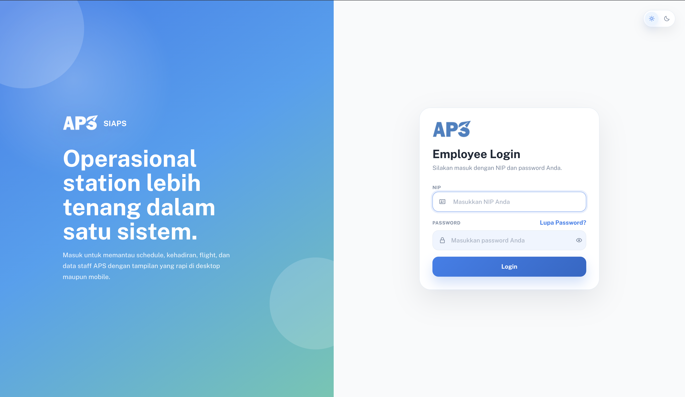 | 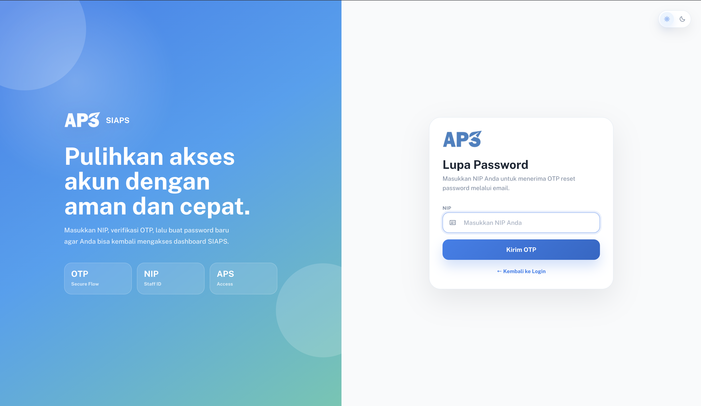 | 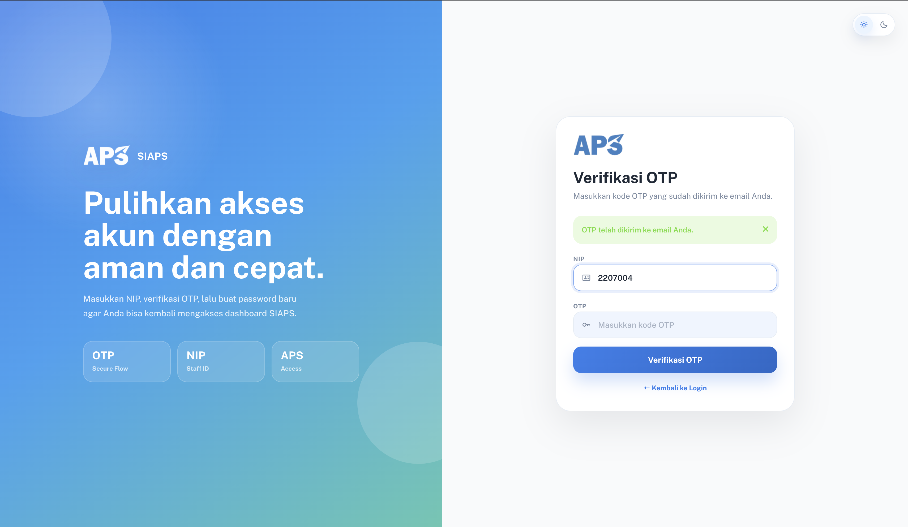 |

- **Login Employee:** Masuk menggunakan NIP dan password terdaftar.
- **Forgot Password & OTP:** Mengirimkan kode OTP unik ke email terdaftar untuk reset password yang aman.

---

### 2. Dashboard Operasional Realtime
Dashboard interaktif menyajikan ringkasan status operasional station secara *live*, metrik pekerjaan berjalan, total staf aktif, staf bertugas, serta grafik performa.

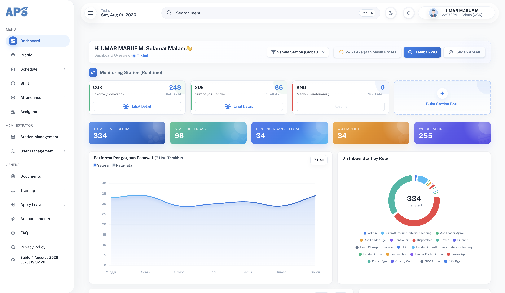

- **Global & Station Filter:** Memantau indikator operasional secara menyeluruh (*Global*) maupun per *Station* spesifik.
- **Dynamic Quick Action:** Akses cepat ke penambahan *Work Order*, absensi hari ini, serta informasi profil pegawai.

---

### 3. User & Staff Management
Pengelolaan master data karyawan lengkap dengan kategori unit operasional (Apron, BGE, Office), import/export Excel, dan sistem *blacklist* pegawai.

| Data Staff & Filtering | Blacklist Pegawai | User Profile |
| :---: | :---: | :---: |
| 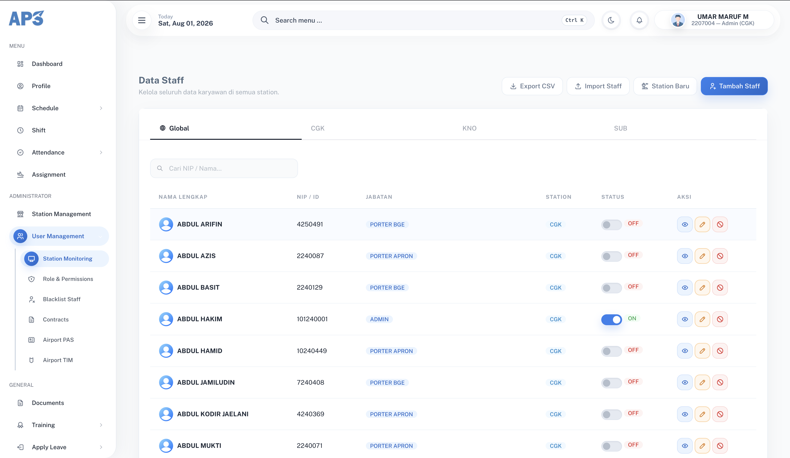 | 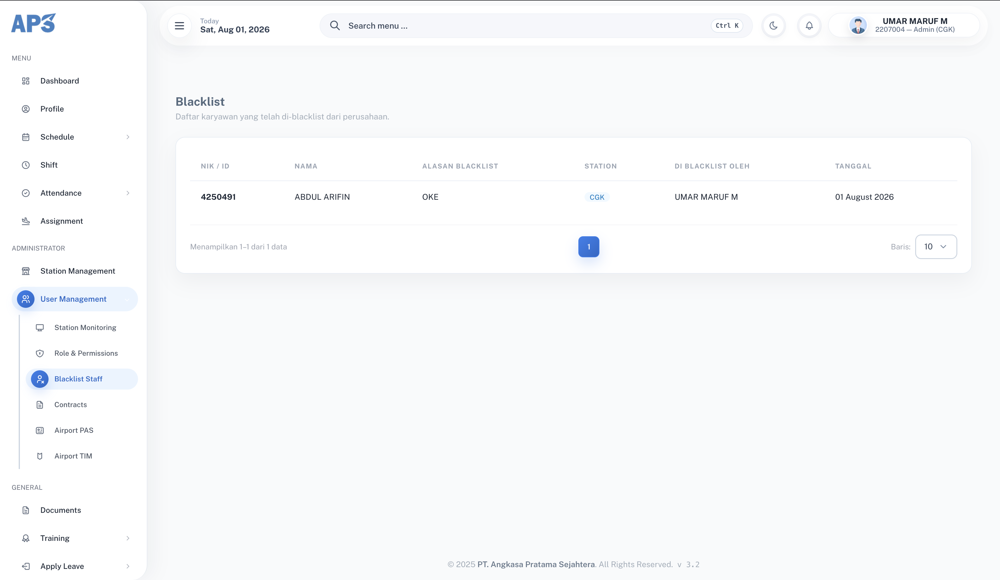 | 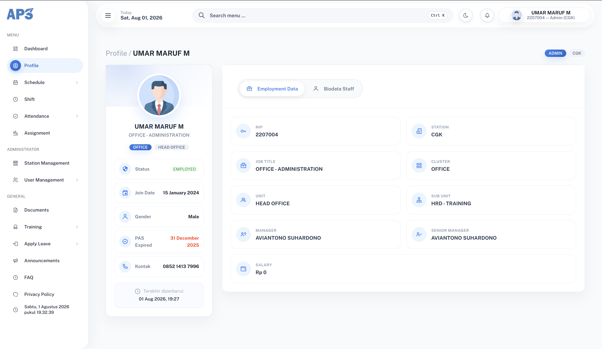 |

- **Multi-Unit Categorization:** Pengelompokan cepat pegawai berdasarkan unit (Apron, BGE, dan Office).
- **Import/Export Staf:** Kemudahan manajemen data massal melalui format spreadsheet (.xlsx / .csv).
- **Blacklist Karyawan:** Pencatatan dan pembekuan akun pegawai pelanggar aturan perusahaan beserta riwayat alasannya.

---

### 4. Monitoring Masa Berlaku Legalitas Pegawai
Sistem peringatan otomatis (*early warning system*) untuk memantau tanggal kedaluwarsa dokumen penting pegawai:
- 🔴 **Merah:** Masa berlaku < 30 Hari
- 🟡 **Kuning:** Masa berlaku < 60 Hari

| Manajemen Kontrak | PAS Tahunan Bandara | TIM (Tanda Izin Mengemudi) |
| :---: | :---: | :---: |
| 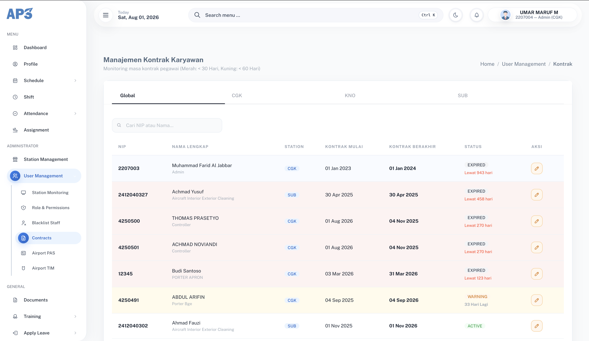 | 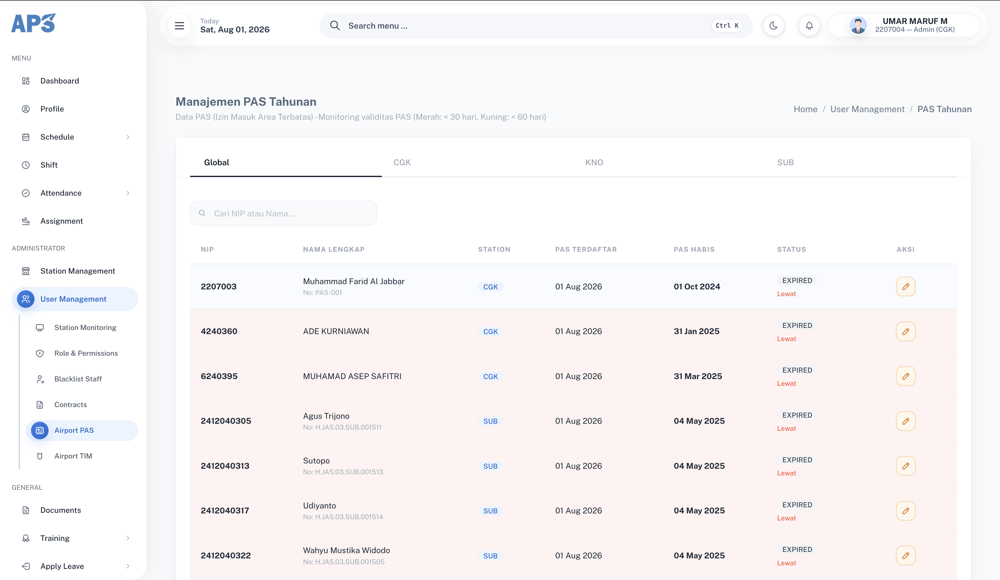 | 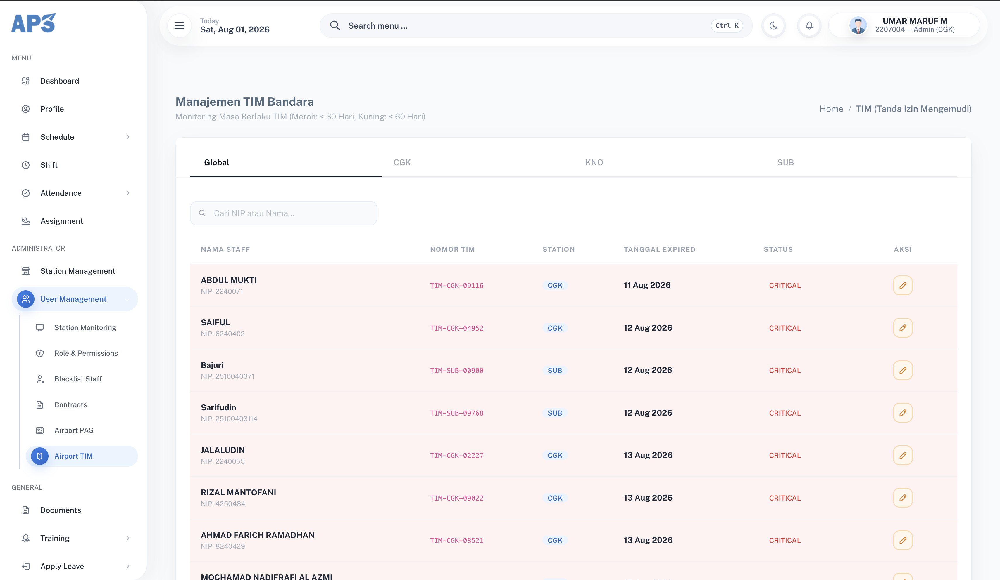 |

- **Manajemen Kontrak:** Memantau sisa durasi masa kerja karyawan.
- **PAS Bandara:** Monitoring validitas PAS area terbatas bandara demi kepatuhan regulasi keamanan penerbangan.
- **TIM Bandara:** Memantau masa berlaku Tanda Izin Mengemudi kendaraan operasional apron/airside.

---

### 5. Hak Akses Role (RBAC) & Manajemen Station
Pengaturan wewenang fleksibel per peran (*Role*) dan kontrol operasional tiap stasiun lokasi.

| Hak Akses Role (RBAC) | Manajemen Station (Kill Switch) |
| :---: | :---: |
| 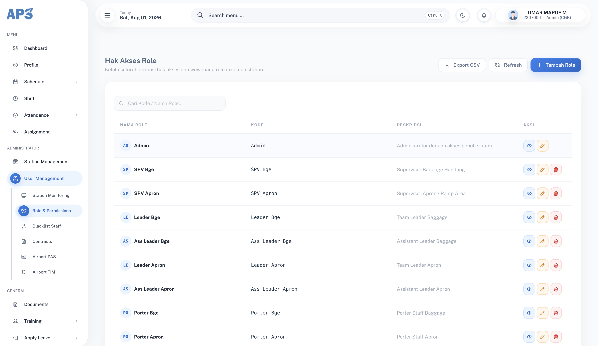 | 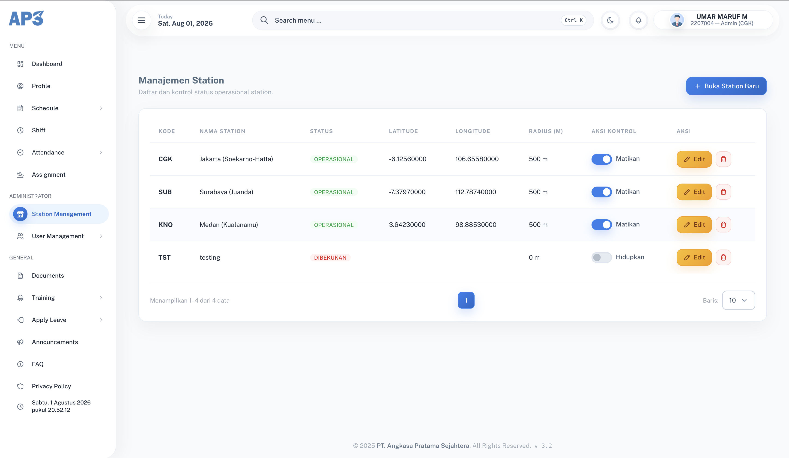 |

- **Role-Based Access Control:** Pengaturan izin akses modul secara terperinci per *Role* (Admin, SPV, Leader, Staff).
- **Station Management & Geofencing:** Pengelolaan stasiun kerja, penetapan koordinat lokasi GPS (latitude & longitude), serta *toggle* status aktif/nonaktif station.

---

### 6. Schedule & Master Shift Management
Pengaturan jadwal kerja harian, integrasi *shift* kerja, dan fitur pembuat jadwal otomatis.

| Jadwal Operasional Hari Ini | Master Shift Management |
| :---: | :---: |
| 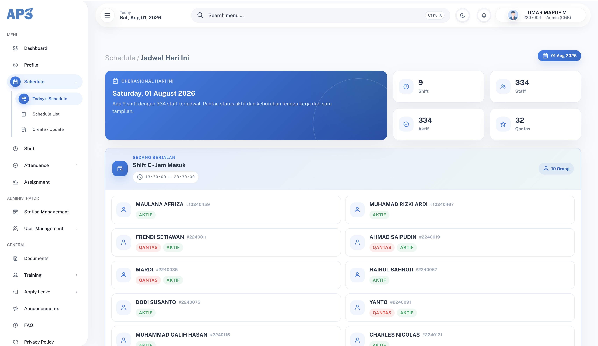 | 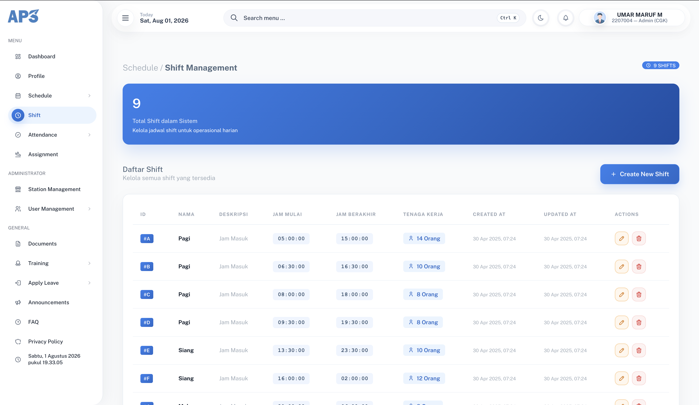 |

- **Schedule Realtime:** Memantau siapa saja pegawai yang bertugas di shift hari ini.
- **Auto Create Schedule:** Generator pembuatan jadwal otomatis bulanan/mingguan.
- **Master Shift:** Kustomisasi jam masuk, jam keluar, dan kode shift format 24 jam.

---

### 7. Absensi Realtime & Koreksi Absensi
Mencatat kehadiran pegawai menggunakan verifikasi lokasi (GPS) dan tangkapan kamera secara langsung, serta alur pengajuan koreksi absensi.

| Verifikasi Absensi (GPS + Camera) | Approval Koreksi Absensi |
| :---: | :---: |
| 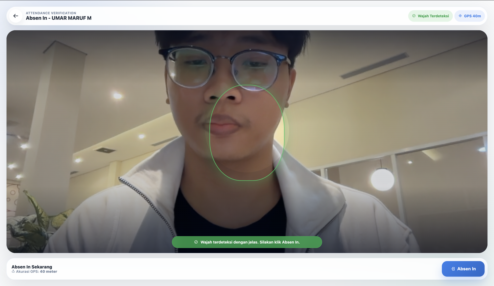 | 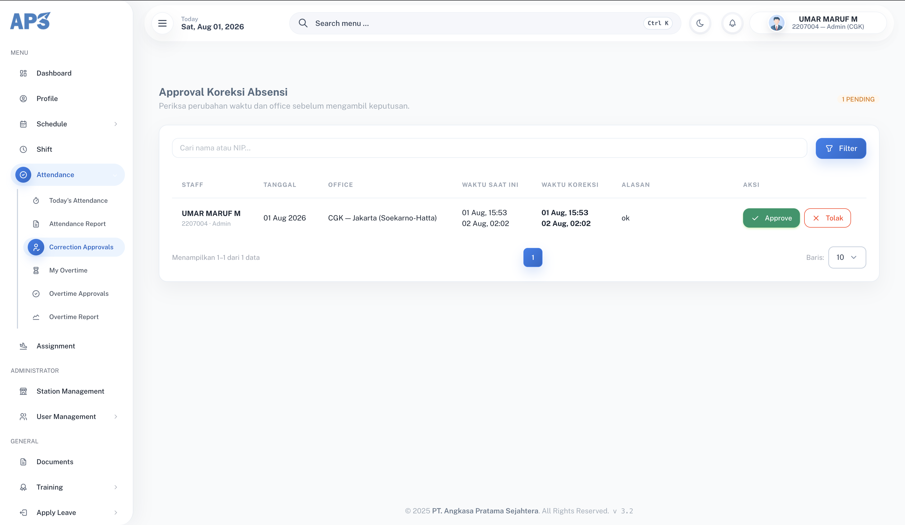 |

- **Absen In / Absen Out:** Validasi lokasi geofencing presisi tinggi serta verifikasi wajah secara gratis via WebRTC camera.
- **Koreksi Absensi:** Staf dapat mengajukan koreksi jam kehadiran beserta alasan/lampiran jika terjadi kendala operasional, yang akan diproses oleh SPV/Admin.

---

### 8. Lembur (Overtime) Management
Pengelolaan lembur staf mulai dari pengajuan, persetujuan bertingkat oleh Leader/SPV, hingga rekapitulasi laporan lembur.

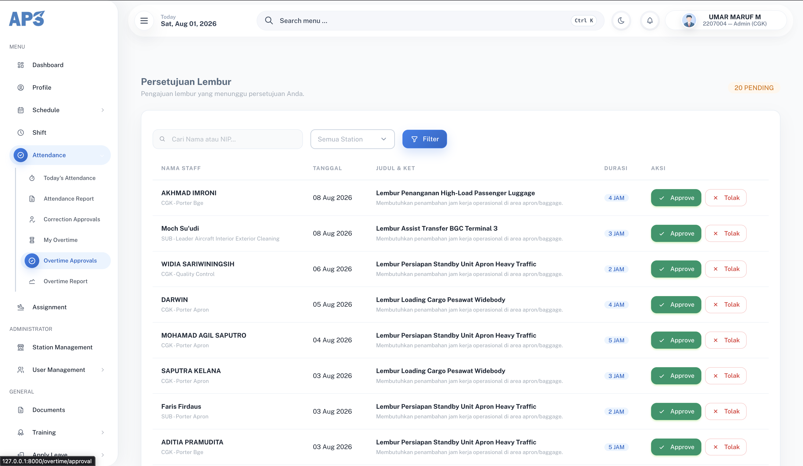

- **Pengajuan & Tracking:** Staf dapat membuat pengajuan lembur beserta detail jam dan nama kegiatan.
- **Leader Approval:** Persetujuan langsung oleh Leader/SPV stasiun setempat.
- **Rekap Payroll:** Export laporan total jam lembur yang telah disetujui dalam format Excel.

---

### 9. Work Orders (Aircraft Deep Cleaning)
Pencatatan dan pemantauan pengerjaan pembersihan pesawat (*Deep Cleaning Interior & Exterior* - DCI & DCE).

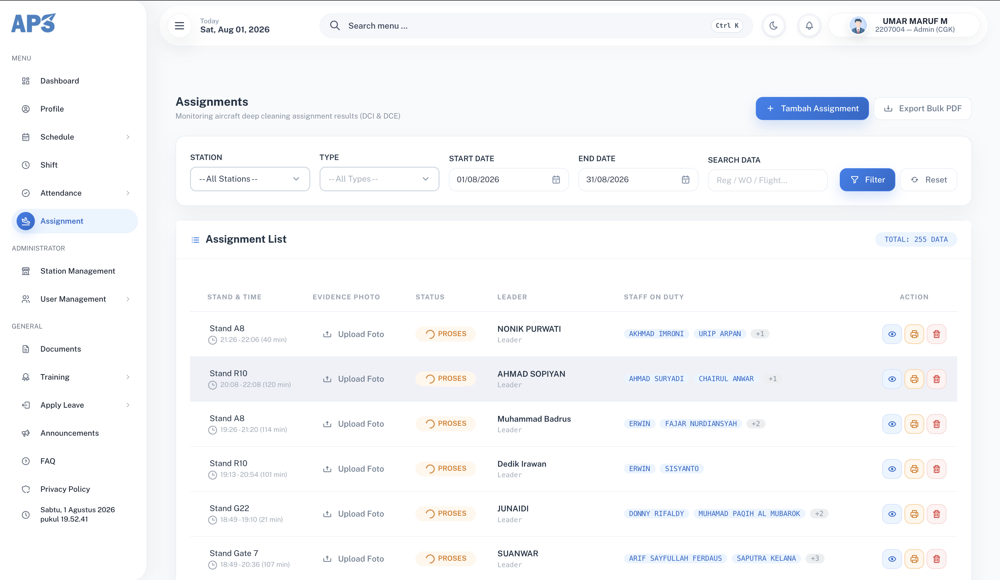

- **Assignment Aircraft:** Penugasan tim pada nomor penerbangan (*Flight*) dan registrasi pesawat spesifik.
- **Bukti Pekerjaan:** Upload foto hasil kerja pengerjaan interior/eksterior pesawat.
- **Export Report:** Cetak laporan hasil pengerjaan pesawat dalam format PDF tunggal maupun bulk PDF.

---

### 10. Pengajuan & Approval Cuti (Leave Management)
Pengelolaan alokasi cuti tahunan pegawai, pengajuan izin/cuti, serta modal persetujuan/penolakan dengan catatan alasan.

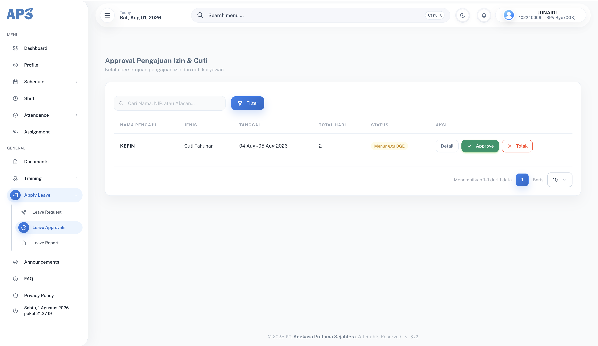

- **Tracking Sisa Cuti:** Menampilkan sisa kuota cuti tahunan pegawai secara transparan.
- **Persetujuan Interaktif:** SPV/Manager dapat menyetujui atau menolak pengajuan disertai alasan penolakan.
- **Laporan Cuti:** Rekapitulasi tahunan data cuti pegawai seluruh stasiun.

---

### 11. Training & Sertifikasi Pegawai
Monitoring kelengkapan dan lisensi sertifikat kualifikasi kerja staf pendukung penerbangan.

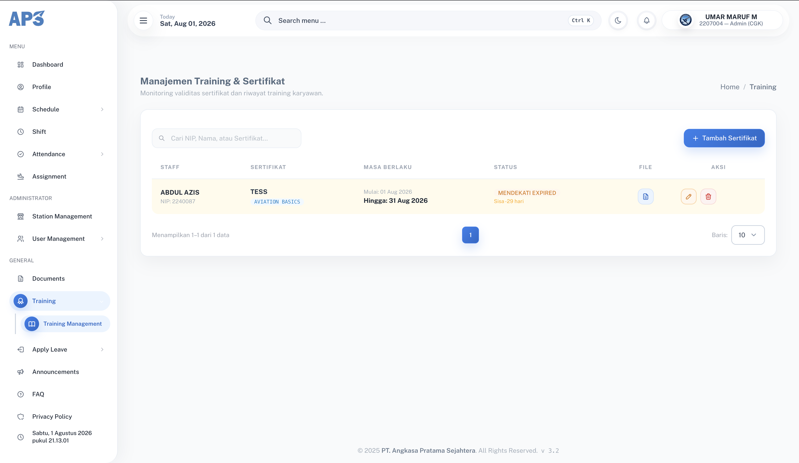

- **Admin & User View:** Pegawai dapat melihat sertifikat pribadi (*My Certificates*), dan Admin dapat mengelola master sertifikat seluruh staf.
- **Alert Expired:** Notifikasi masa berlaku sertifikat kualifikasi kerja.

---

### 12. Broadcast Pengumuman & Pusat Dokumen
Penyampaian informasi resmi stasiun dan portal unduhan dokumen operasional.

| Broadcast Pengumuman | Pusat Dokumen Resmi |
| :---: | :---: |
| 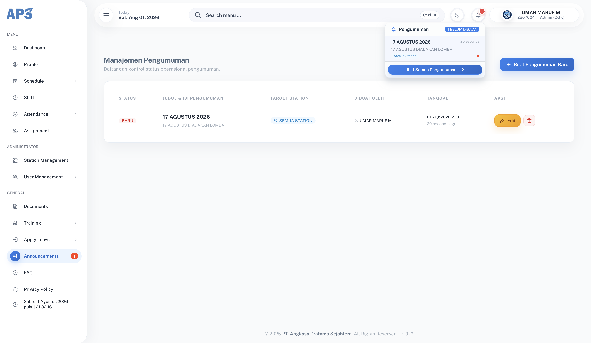 | 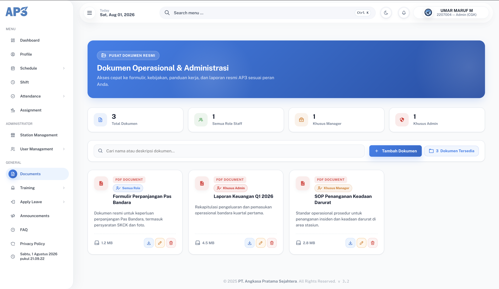 |

- **Announcement System:** Penyiaran pengumuman penting ke seluruh stasiun atau stasiun tertentu dengan status *read/unread*.
- **Official Document Repository:** Pusat akses file panduan kerja, SOP, dan formulir resmi sesuai hak akses *Role*.

---

## Teknologi yang Digunakan

- **Framework Backend:** [Laravel 12](https://laravel.com/)
- **Bahasa Pemrograman:** PHP >= 8.2 (Production: PHP 8.3-FPM)
- **Database Server:** MySQL / MariaDB
- **Frontend Build Tool:** [Vite](https://vitejs.dev/)
- **CSS & UI Framework:** Tailwind CSS & Blade Components
- **Media & Camera API:** HTML5 WebRTC MediaDevices API
- **Location Service:** Geolocation API (Latitude, Longitude, Accuracy)
- **Export Spreadsheet:** `maatwebsite/excel`
- **PDF Generator:** `barryvdh/laravel-dompdf`
- **Alert & Toast UI:** `realrashid/sweet-alert`
- **Web Server Production:** Nginx
- **Automation Tools:** GitHub Actions CI/CD (SSH deploy) & Rclone (Google Drive backup)

---

## Struktur Modul & Mapping Route Utama

Below is a detailed map of primary routes available in the system:

### 🔑 Authentication & Password Recovery
```text
GET  /                              -> Login Form
POST /actionlogin                   -> Process Login
POST /logout                        -> Logout
GET  /verify-otp                    -> Show OTP Verification Form
POST /verify-otp                    -> Process OTP Verification
POST /resend-otp                    -> Resend OTP Code
GET  /forgot-password               -> Forgot Password Form
POST /forgot-password               -> Send Reset OTP
POST /forgot-password/verify        -> Verify Reset OTP Code
GET  /forgot-password/change        -> Password Change Form
POST /forgot-password/change        -> Update Password
```

### 📊 Dashboard & Profil
```text
GET  /home                          -> Main Dashboard Overview
GET  /profile/{id}                  -> Admin View User Profile
GET  /user/profile/{id}             -> User View Own Profile
POST /update-photo/{userId}         -> Update Profile Photo
GET  /change-password               -> Change Password Page
POST /update-password               -> Process Update Password
```

### 👥 Staff & User Management
```text
GET  /staff-data                    -> Staf Monitoring Index
GET  /staff/export                  -> Export Data Staf (Excel)
POST /staff/import                  -> Import Data Staf
GET  /staff/template                -> Download Template Import
POST /staff/toggle/{id}             -> Toggle Active/Inactive Status Staf
GET  /users                         -> Resource CRUD User Management
GET  /users/apron                   -> Filter User Apron
GET  /users/bge                     -> Filter User BGE
GET  /users/office                  -> Filter User Office
PUT  /reset-password/{id}           -> Admin Reset Password User
```

### 🚫 Blacklist Karyawan
```text
GET  /blacklist-data                -> List Karyawan Di-Blacklist
GET  /blacklist                     -> Blacklist Management Page
POST /blacklist                     -> Tambahkan Staf ke Blacklist
DELETE /blacklist/{id}              -> Hapus Staf dari Blacklist
```

### 📜 Legalitas Pegawai (Kontrak, PAS, TIM)
```text
GET  /kontrak                       -> Monitoring Masa Kontrak Karyawan
GET  /kontrak/edit/{id}             -> Edit Masa Kontrak
PUT  /kontrak/update/{user}         -> Update Data Kontrak
GET  /pas                           -> Monitoring PAS Tahunan Bandara
GET  /pas/edit/{id}                 -> Edit PAS Bandara
PUT  /pas/update/{user}             -> Update Data PAS
GET  /tim                           -> Monitoring TIM Bandara
GET  /tim/edit/{id}                 -> Edit TIM Bandara
PUT  /tim/update/{user}             -> Update Data TIM
```

### 🛡️ Hak Akses Role (RBAC) & Station
```text
GET  /roles                         -> List Role & Module Permissions
POST /roles/{id}/toggle-user        -> Toggle User Assignment in Role
GET  /stations                      -> Station Management List
GET  /stations/create               -> Form Tambah Station
POST /stations/store                -> Simpan Station Baru
POST /stations/toggle/{id}          -> Toggle Status Aktif Station
PUT  /stations/{station}/update     -> Update Data & Koordinat Station
DELETE /stations/{id}               -> Hapus Station
```

### 📅 Schedule & Shift Management
```text
GET  /schedule                      -> Index Schedule
GET  /schedule-now                  -> Schedule Operasional Hari Ini
GET  /schedule/show                 -> Detail Schedule View
POST /schedule/auto-create          -> Auto Generate Schedule
POST /schedule/import               -> Import Schedule Excel
POST /schedule/update/{userId}/{dt} -> Update Jadwal Staf
RESOURCE /shift                     -> Master Shift CRUD
```

### ⏰ Attendance & Koreksi Absensi
```text
GET  /attendance                    -> Today's Attendance Dashboard
GET  /attendance/camera             -> Camera WebRTC Attendance Scanner
POST /attendance/check-in           -> Check-In Attendance with GPS & Photo
POST /attendance/check-out          -> Check-Out Attendance
GET  /attendance/history            -> History Kehadiran
GET  /attendance/reports            -> Laporan Absensi Periodik
GET  /attendance/export             -> Export Laporan Absensi
GET  /attendance/history/{dt}/correction -> Form Pengajuan Koreksi Absensi
GET  /attendance/corrections/approval    -> Page Approval Koreksi Absensi
POST /attendance/corrections/{id}/approve -> Approve Koreksi Absensi
POST /attendance/corrections/{id}/reject  -> Reject Koreksi Absensi
```

### ⏱️ Overtime (Lembur)
```text
GET  /overtime                      -> Riwayat Lembur Saya
GET  /overtime/create               -> Form Pengajuan Lembur
POST /overtime/store                -> Submit Pengajuan Lembur
GET  /overtime/approval             -> Page Approval Lembur Leader/SPV
POST /overtime/{id}/approve         -> Approve Lembur
POST /overtime/{id}/reject          -> Reject Lembur
GET  /overtime/report               -> Rekap Laporan Lembur
GET  /overtime/export               -> Export Rekap Lembur (Excel)
```

### ✈️ Work Orders & Flight Management
```text
GET  /work-orders                   -> Aircraft Deep Cleaning Assignments List
GET  /work-orders/create            -> Form Assignment Work Order Baru
POST /work-orders/store             -> Simpan Assignment Work Order
POST /work-orders/fetch-flight-data -> Fetch Auto Flight Data
POST /work-orders/import            -> Bulk Import Work Orders
GET  /work-orders/export/pdf        -> Export Rekap Bulk PDF
GET  /work-orders/{id}/export-pdf   -> Export PDF Single Work Order
POST /work-orders/{id}/upload-photo -> Upload Foto Hasil Kerja Aircraft
GET  /flights                       -> Master Penerbangan (Flight) List
```

### 🌴 Leave (Cuti & Izin)
```text
GET  /leaves/apply                  -> Form Pengajuan Cuti/Izin
POST /leaves                        -> Submit Pengajuan Cuti
GET  /my-leaves                     -> Riwayat Cuti Pribadi
GET  /leaves/approval               -> Page Approval Cuti Manager/SPV
PATCH /leaves/{leave}/status        -> Update Status Approval Cuti
PATCH /leaves/{leave}/cancel        -> Batalkan Pengajuan Cuti
GET  /leaves/laporan                -> Rekap Laporan Cuti Karyawan
GET  /leaves/export                 -> Export Laporan Cuti
```

### 🎓 Training & Certificates
```text
GET  /my-certificates               -> Sertifikat Saya
GET  /training                      -> Admin Management Sertifikat & Training
GET  /training/create               -> Form Tambah Sertifikat Staf
POST admin/training/certificates    -> Simpan Sertifikat Staf
PUT  admin/training/certificates/{id}-> Update Sertifikat Staf
DELETE /training/destroy/{id}       -> Hapus Sertifikat Staf
```

### 📢 Announcements & Documents
```text
GET  /announcements                 -> Daftar Pengumuman Station
GET  /announcements/create          -> Form Buat Pengumuman Baru
POST /announcements                 -> Terbitkan Pengumuman
POST /announcements/{id}/read       -> Tandai Pengumuman Telah Dibaca
GET  /document                      -> Pusat Dokumen Resmi (User Access)
GET  /admin/documents               -> Management Dokumen (Admin View)
POST /admin/documents               -> Upload Dokumen Baru
```

---

## Petunjuk Running Local Development

### 1. Clone Repository
```bash
git clone https://github.com/apsonemailserver-cloud/apsone.git
cd apsone
```

### 2. Install Dependency PHP & Frontend
```bash
composer install
npm install
```

### 3. Konfigurasi Environment File
```bash
cp .env.example .env
php artisan key:generate
```

Sesuaikan konfigurasi database MySQL di file `.env`:
```env
DB_CONNECTION=mysql
DB_HOST=127.0.0.1
DB_PORT=3306
DB_DATABASE=nama_database
DB_USERNAME=root
DB_PASSWORD=
```

### 4. Database Migration & Storage Link
```bash
php artisan migrate
php artisan db:seed        # Jalankan jika seeder tersedia
php artisan storage:link
```

### 5. Jalankan Application Development
Opsi A (Menjalankan server & Vite secara simultan):
```bash
composer run dev
```

Opsi B (Dua terminal terpisah):
```bash
# Terminal 1
php artisan serve

# Terminal 2
npm run dev
```

Buka URL di browser: `http://127.0.0.1:8000`

---

## Deployment ke Production Server

Aplikasi dideploy ke VPS Ubuntu tanpa Docker menggunakan stack **Nginx + PHP 8.3-FPM + MySQL** dengan SSL Let's Encrypt.


### Alur Deploy Otomatis (CI/CD GitHub Actions):
1. Push / Merge code ke branch `main`.
2. Workflow `.github/workflows/deploy.yml` dipemicu secara otomatis.
3. GitHub Actions terhubung ke VPS via SSH secret (`VPS_IP`, `VPS_USERNAME`, `VPS_SSH_KEY`).
4. Menjalankan `git pull origin main`, instalasi dependency `--no-dev`, `npm run build`, pembuatan `storage:link`, dan `php artisan optimize`.
5. Restart layanan `php8.3-fpm` & reload `nginx`.

### Script Deploy Manual di Server VPS:
```bash
cd /home/ubuntu/apsone
git pull origin main
composer install --no-dev --optimize-autoloader
npm install
npm run build
php artisan storage:link
php artisan config:clear
php artisan route:clear
php artisan view:clear
php artisan cache:clear
php artisan optimize
sudo systemctl restart php8.3-fpm
sudo systemctl reload nginx
```

Production Domain: [https://myapsone.com](https://myapsone.com)

---

## Backup Otomatis Database & Assets

Sistem ini dilengkapi skrip otomatisasi backup harian untuk mengamankan database, aset yang diunggah pengguna, dan source code aplikasi ke Google Drive.


### Lokasi Skrip & Cron Schedule
- File Skrip: `backup/backup_apsone.sh`
- Jadwal Cron (Jalan setiap hari pukul 00:00 WIB):
```cron
0 0 * * * /home/ubuntu/apsone/backup/backup_apsone.sh >/dev/null 2>&1
```

### Hasil Backup di Google Drive:
Folder Tujuan: `gdrive:Backups/apsone/YYYY-MM-DD/`
- `apsone_database_YYYY-MM-DD_HH-MM-SS.sql.gz`
- `apsone_assets_YYYY-MM-DD_HH-MM-SS.tar.gz`
- `apsone_code_YYYY-MM-DD_HH-MM-SS.tar.gz`

Petunjuk rinci pemulihan data terdapat pada `backup/README.md`.

---

## Troubleshooting Umum

### 1. View / Route Not Found di Server Linux
Linux bersifat *case-sensitive*. Pastikan nama folder view dan panggilan pada controller menggunakan huruf kecil yang sesuai.

### 2. Gambar / Storage File Retak (404 Not Found)
Jalankan ulang perintah tautan storage dan pastikan ijin akses folder `storage/app/public` sudah benar:
```bash
php artisan storage:link
sudo chmod -R 775 storage bootstrap/cache
```

### 3. Cache Laravel Masih Menyimpan Data Lama
Bersihkan seluruh cache aplikasi:
```bash
php artisan optimize:clear
php artisan optimize
```

---

## Status System Production Saat Ini

- **Domain Active:** `https://myapsone.com`
- **Environment:** Production (Nginx + PHP 8.3-FPM)
- **Database Engine:** MySQL
- **Backup Cloud:** Rclone Google Drive (Harian Pukul 00:00 WIB)
- **CI/CD Pipeline:** GitHub Actions Automated Deployment
